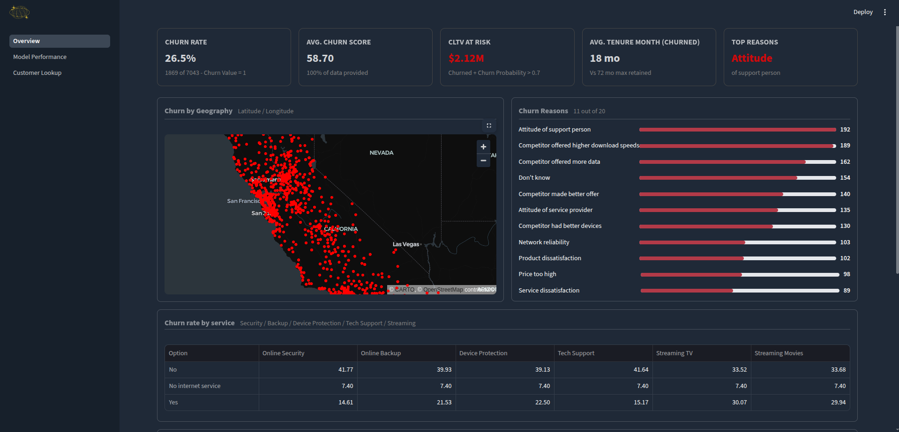
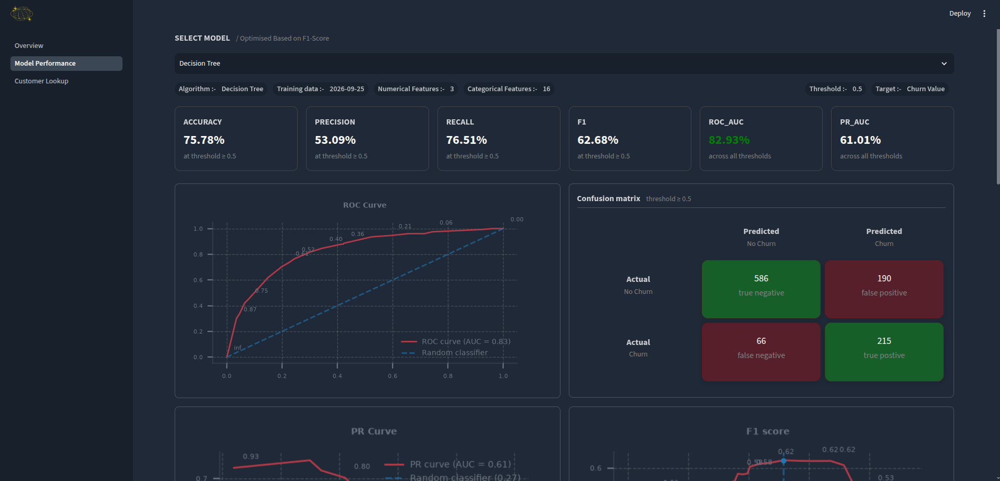
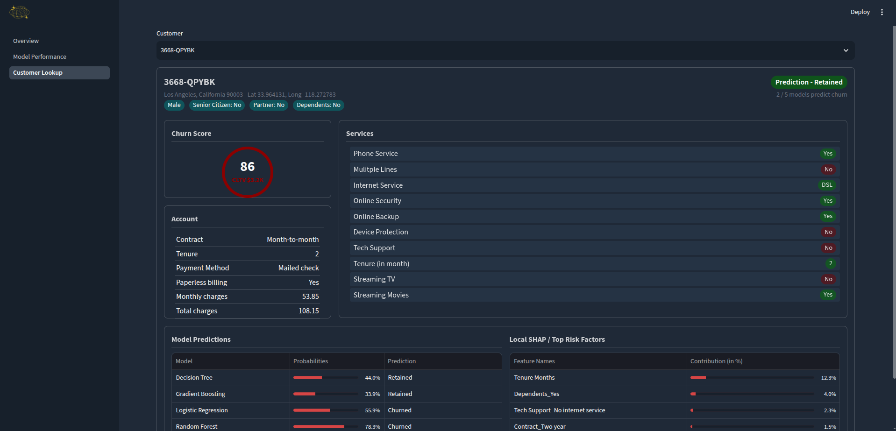

# ChurnPredict

An end-to-end **customer churn prediction and monitoring dashboard** built with Python, Scikit-learn, XGBoost, SHAP, PSI, and Streamlit.

## Dashboard

### Overview



### Model Performance



### Customer Lookup



## ML Pipeline

**Data Cleaning → EDA → Preprocessing → Model Training → Hyperparameter Tuning → Threshold Optimization → Explainability → Monitoring**

- Multiple classification models: Logistic Regression, Decision Tree, Random Forest, Gradient Boosting, XGBoost
- Model evaluation: Precision, Recall, F1, ROC-AUC, PR-AUC, Confusion Matrix
- **SHAP** for global and individual prediction explanations
- **PSI** for feature distribution drift monitoring
- Customer-level churn risk and CLTV analysis
- Interactive Streamlit dashboard

## Tech Stack

`Python` · `Pandas` · `Scikit-learn` · `XGBoost` · `SHAP` · `Matplotlib` · `Streamlit` · `Joblib`

## Run Locally

```bash
git clone <repository-url>
cd <repository-name>
pip install -r requirements.txt
streamlit run streamlit/app.py
```

## Project Structure

```text
├── data/
├── models/
├── images/
├── streamlit/
├── notebooks/
├── requirements.txt
└── README.md
```

## Links

- **GitHub:** <repository-url>
- **Live Demo:** <streamlit-app-url>
